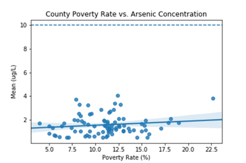

# Minnesota Drinking Water Quality Analysis
Who in Minnesota has access to safe drinking water? This project determined whether there is a relationship between Minnesota’s drinking water quality and poverty rates in each county

### Data Manipulation
Three contaminant levels in municipal water supplies throughout the state in 2017 were selected from the EPA database. These contaminants are Arsenic, Nitrate, and Uranium. Poverty rates by county from (database) are sorted in descending order and binned into five groups. The following two questions were addressed:

1. Is there a significance difference between the mean concentration of a particular contaminant in a group compared to another?

2. Is there a significance difference between the mean concentration of a particular contaminant in the wealthiest counties compared to the poorest?
### Statistical Methods
 
1. ANOVA (addresses the first question)

-	Null Hypothesis: the mean concentration of contaminant is the same across the grouped counties
- Alternative Hypothesis: There are significant differences in contaminants between any counties
2. Student t-test (addresses the second question)
-	Null Hypothesis: the mean concentration of contaminant is the same among the wealthiest and poorest grouped counties
-	Alternative Hypothesis: There are significant differences in contaminants between the wealthiest and poorest grouped counties.

### Visualization 
    
### Findings
ANOVA and t-test failed to show that low income areas have poorer water quality than wealthier areas in Minnesota, or that there is a significant difference in water quality between any of the county groupings. Given more time and available resources, we could examine the water quality by the city-level instead of by county-level. Performing the ANOVA on grouped cities might or might not unveil more findings about their population means. If at least one population mean is different from the others, further testing (ad hoc test) will be needed to identify which groups are different from another
